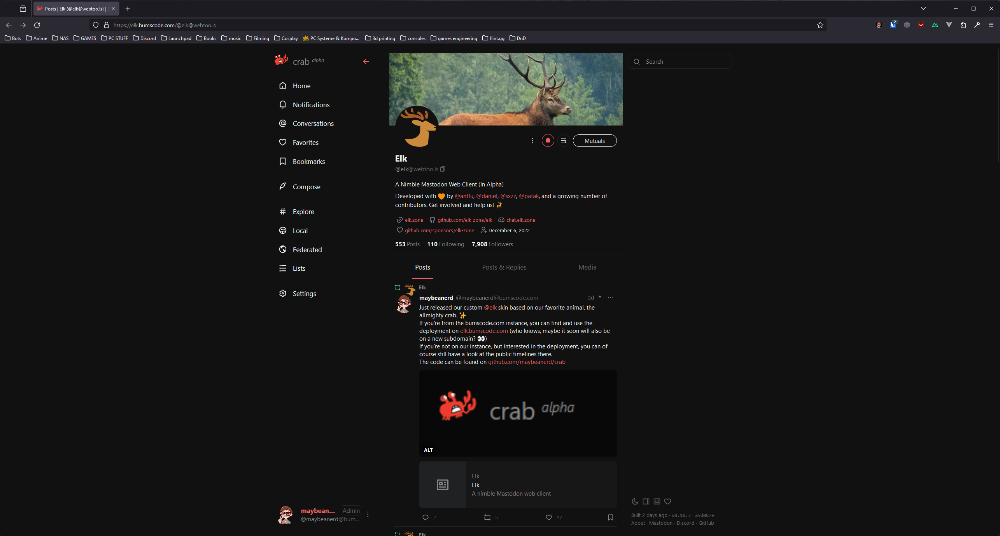

<p align="center">
  <a href="https://elk.bumscode.com" target="_blank" rel="noopener noreferrer">
    
  </a>
</p>

<h1 align="center"/>Crab <sup><em>alpha</em></sup></h1>

A nimble Mastodon web client, customized for [bumscode.com](https://bumscode.com).


<br/>


<p align="center">
  <a href="https://elk.bumscode.com/" target="_blank" rel="noopener noreferrer" >
    
  </a>
</p>

## ⚠️ Crab and its parent Elk are in Alpha

If you want to contribute to the parent project, check out [its repo](https://github.com/elk-zone/elk).

## Deployment

### Official Deployment

The Crab team maintains a deployment at:

- 🦀 Production: [elk.bumscode.com](https://elk.bumscode.com)

## 💖 Sponsors

If you're enjoying the app, consider sponsoring the Elk team:

- [Elk Team's GitHub Sponsors](https://github.com/sponsors/elk-zone)

Or you can sponsor their core team members individually:

- [Anthony Fu](https://github.com/sponsors/antfu)
- [Daniel Roe](https://github.com/sponsors/danielroe)
- [三咲智子 Kevin Deng](https://github.com/sponsors/sxzz)
- [Patak](https://github.com/sponsors/patak-dev)

We would also appreciate sponsoring other contributors to the Elk project. If someone helps you solve an issue or implement a feature you wanted, supporting them would help make this project and OS more sustainable.


## 🚀 Contributing

Feel free to open PRs on this repo if you want to contribute to Crab!
If you want to contribute to Elk, check out their [Contributing Guide](./CONTRIBUTING.md).

### Local Setup

Clone the repository and run on the root folder:

```
pnpm i
pnpm run dev
```

`Warning`: you will need `corepack` enabled, check out the [Elk Contributing Guide](./CONTRIBUTING.md) for a detailed guide on how to set up the project locally.

We recommend installing [ni](https://github.com/antfu/ni#ni), that will use the right package manager in each of your projects. If `ni` is installed, you can instead run:

```
ni
nr dev
```

### Testing

Elk uses [Vitest](https://vitest.dev). You can run the test suite with:

```
nr test
```

## 📲 PWA

You can consult the [PWA documentation](https://docs.elk.zone/pwa) to learn more about the PWA capabilities on Elk, how to install Elk PWA in your desktop or mobile device and some hints about PWA stuff on Elk.

## 🦄 Stack

- [Vite](https://vitejs.dev/) - Next Generation Frontend Tooling
- [Nuxt](https://nuxt.com/) - The Intuitive Web Framework
- [Vue](https://vuejs.org/) - The Progressive JavaScript Framework
- [VueUse](https://vueuse.org/) - Collection of Vue Composition Utilities
- [Pinia](https://pinia.vuejs.org/) - The Vue Store that you will enjoy using
- [Vue Macros](https://vue-macros.sxzz.moe/) - More macros and syntax sugar for Vue
- [UnoCSS](https://uno.antfu.me/) - The instant on-demand atomic CSS engine
- [Iconify](https://github.com/iconify/icon-sets#iconify-icon-sets-in-json-format) - Iconify icon sets in JSON format
- [Masto.js](https://neet.github.io/masto.js) - Mastodon API client in TypeScript
- [shiki](https://shiki.matsu.io/) - A beautiful Syntax Highlighter
- [vite-plugin-pwa](https://github.com/vite-pwa/vite-plugin-pwa) - Prompt for update, Web Push Notifications and Web Share Target API

## 👨‍💻 Contributors
<a href="https://github.com/maybeanerd/crab/graphs/contributors">
     
</a>

## 📄 License

[MIT](./LICENSE) &copy; 2022-PRESENT Crab & Elk contributors
