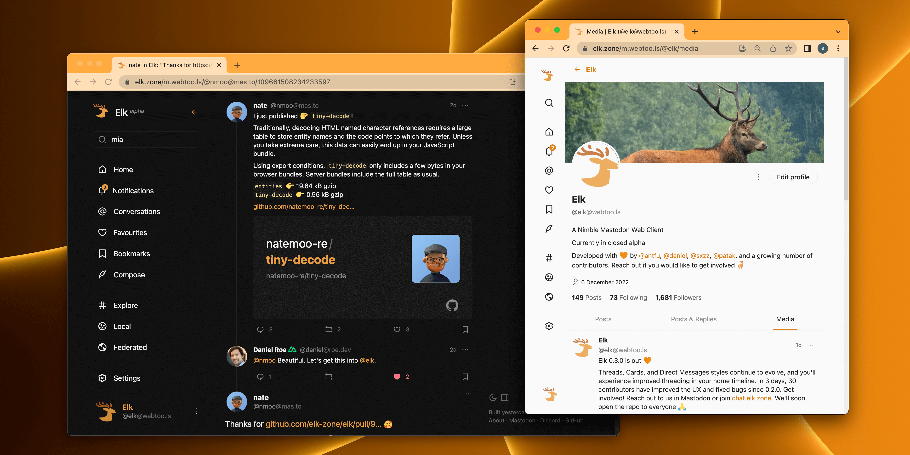

<p align="center">
  <a href="https://elk.zone" target="_blank" rel="noopener noreferrer">
    
  </a>
</p>

<h1 align="center"/>Elk <sup><em>alpha</em></sup></h1>

<p align="center">
A nimble Mastodon web client
</p>

<br/>
<p align="center">
  <a href="https://chat.elk.zone"></a>
  <a href="https://pr.new/elk-zone/elk"></a>
  <a href="https://volta.net/elk-zone/elk?utm_source=elk_readme"></a>
</p>
<br/>

<p align="center">
  <a href="https://elk.zone/" target="_blank" rel="noopener noreferrer" >
    
  </a>
</p>

## ⚠️ Elk is in Alpha

It is already quite usable, but it isn't ready for wide adoption yet. We recommend you use it if you would like to help us build it. We appreciate your feedback and contributions. Check out the [Open Issues](https://github.com/elk-zone/elk/issues) and jump in the action. Join the [Elk discord server](https://chat.elk.zone) to chat with us and learn more about the project.

## Deployment

### Official Deployment

The Elk team maintains a deployment at:

- 🦌 Production: [elk.zone](https://elk.zone)
- 🐙 Canary: [main.elk.zone](https://main.elk.zone) (deploys on every commit to `main` branch)

### Self-Host Docker Deployment

In order to host Elk yourself you can use the provided Dockerfile to build a container with elk. Be aware, that Elk only loads properly if the connection is done via SSL/TLS. The Docker container itself does not provide any SSL/TLS handling. You'll have to add this bit yourself.
One could put Elk behind popular reverse proxies with SSL Handling like Traefik, NGINX etc.

1. checkout source ```git clone https://github.com/elk-zone/elk.git```
1. got into new source dir: ```cd elk```
1. create local storage directory for settings: ```mkdir elk-storage```
1. adjust permissions of storage dir: ```sudo chown 911:911 ./elk-storage```
1. start container: ```docker-compose up --build -d```

> [!NOTE]
> The provided Dockerfile creates a container which will eventually run Elk as non-root user and create a persistent named Docker volume upon first start (if that volume does not yet exist). This volume is always created with root permission. Failing to change the permissions of ```/elk/data``` inside this volume to UID:GID 911 (as specified for Elk in the Dockerfile) will prevent Elk from storing it's config for user accounts. You either have to fix the permission in the created named volume, or mount a directory with the correct permission to ```/elk/data``` into the container.

### Ecosystem

These are known deployments using Elk as an alternative Web client for Mastodon servers or as a base for other projects in the fediverse:

- [elk.fedified.com](https://elk.fedified.com) - Use Elk to log into any compatible instance
- [elk.me.uk](https://elk.me.uk) - Use Elk to log into any compatible instance, hosted on Google Cloud Run with no Cloudflare proxy
- [elk.h4.io](https://elk.h4.io) - Use Elk for the `h4.io` Server
- [elk.universeodon.com](https://elk.universeodon.com) - Use Elk for the Universeodon Server
- [elk.vmst.io](https://elk.vmst.io) - Use Elk for the `vmst.io` Server
- [elk.hostux.social](https://elk.hostux.social) - Use Elk for the `hostux.social` Server
- [elk.cupoftea.social](https://elk.cupoftea.social) - Use Elk for the `cupoftea.social` Server
- [elk.aus.social](https://elk.aus.social) - Use Elk for the `aus.social` Server
- [elk.mstdn.ca](https://elk.mstdn.ca) - Use Elk for the `mstdn.ca` Server
- [elk.mastodonapp.uk](https://elk.mastodonapp.uk) - Use Elk for the `mastodonapp.uk` Server
- [elk.bolha.us](https://elk.bolha.us) - Use Elk for the `bolha.us` Server
- [crab.bumscode.com](https://crab.bumscode.com) - Use [crab](https://github.com/maybeanerd/crab) - a soft fork of Elk - for the `bumscode.com` Server

> **Note**: Community deployments are **NOT** maintained by the Elk team. It may not be synced with Elk's source code. Please do your own research about the host servers before using them.

## 💖 Sponsors

We are grateful for the generous sponsorship and help of:

<a href="https://nuxtlabs.com/" target="_blank" rel="noopener noreferrer" >
  
</a>
<br><br>
<a href="https://stackblitz.com/" target="_blank" rel="noopener noreferrer" >
  
</a>
<br><br>

And all the companies and individuals sponsoring Elk Team and the members. If you're enjoying the app, consider sponsoring us:

- [Elk Team's GitHub Sponsors](https://github.com/sponsors/elk-zone)

Or you can sponsor our core team members individually:

- [Anthony Fu](https://github.com/sponsors/antfu)
- [Daniel Roe](https://github.com/sponsors/danielroe)
- [三咲智子 Kevin Deng](https://github.com/sponsors/sxzz)
- [Patak](https://github.com/sponsors/patak-dev)

We would also appreciate sponsoring other contributors to the Elk project. If someone helps you solve an issue or implement a feature you wanted, supporting them would help make this project and OS more sustainable.

## 📍 Roadmap

[Open board on Volta](https://volta.net/elk-zone/elk)

## 🧑‍💻 Contributing

We're really excited that you're interested in contributing to Elk! Before submitting your contribution, please read through the following guide.

### Online

You can use [StackBlitz Codeflow](https://stackblitz.com/codeflow) to fix bugs or implement features. You'll also see a Codeflow button on PRs to review them without a local setup. Once the elk repo has been cloned in Codeflow, the dev server will start automatically and print the URL to open the App. You should receive a prompt in the bottom-right suggesting to open it in the Editor or in another Tab. To learn more, check out the [Codeflow docs](https://developer.stackblitz.com/codeflow/what-is-codeflow).

[](https://pr.new/elk-zone/elk)

### Local Setup

Clone the repository and run on the root folder:

```
pnpm i
pnpm run dev
```

`Warning`: you will need `corepack` enabled, check out the [Elk Contributing Guide](./CONTRIBUTING.md) for a detailed guide on how to set up the project locally.

We recommend installing [ni](https://github.com/antfu/ni#ni), that will use the right package manager in each of your projects. If `ni` is installed, you can instead run:

```
ni
nr dev
```

### Testing

Elk uses [Vitest](https://vitest.dev). You can run the test suite with:

```
nr test
```

## 📲 PWA

You can consult the [PWA documentation](https://docs.elk.zone/pwa) to learn more about the PWA capabilities on Elk, how to install Elk PWA in your desktop or mobile device and some hints about PWA stuff on Elk.

## 🦄 Stack

- [Vite](https://vitejs.dev/) - Next Generation Frontend Tooling
- [Nuxt](https://nuxt.com/) - The Intuitive Web Framework
- [Vue](https://vuejs.org/) - The Progressive JavaScript Framework
- [VueUse](https://vueuse.org/) - Collection of Vue Composition Utilities
- [Pinia](https://pinia.vuejs.org/) - The Vue Store that you will enjoy using
- [Vue Macros](https://vue-macros.sxzz.moe/) - More macros and syntax sugar for Vue
- [UnoCSS](https://uno.antfu.me/) - The instant on-demand atomic CSS engine
- [Iconify](https://github.com/iconify/icon-sets#iconify-icon-sets-in-json-format) - Iconify icon sets in JSON format
- [Masto.js](https://neet.github.io/masto.js) - Mastodon API client in TypeScript
- [shiki](https://shiki.style/) - A beautiful yet powerful syntax highlighter
- [vite-plugin-pwa](https://github.com/vite-pwa/vite-plugin-pwa) - Prompt for update, Web Push Notifications and Web Share Target API

## 👨‍💻 Contributors

<a href="https://github.com/elk-zone/elk/graphs/contributors">
  
</a>

## 📄 License

[MIT](./LICENSE) &copy; 2022-PRESENT Elk contributors
